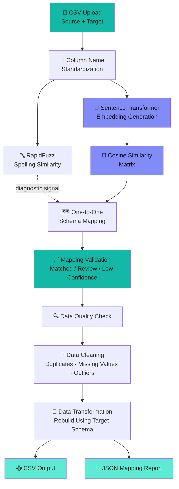
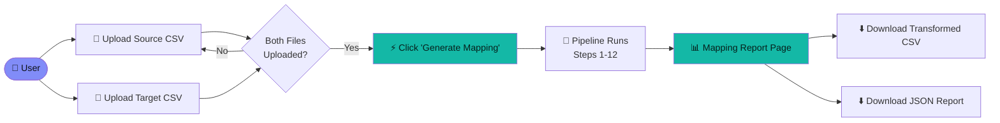
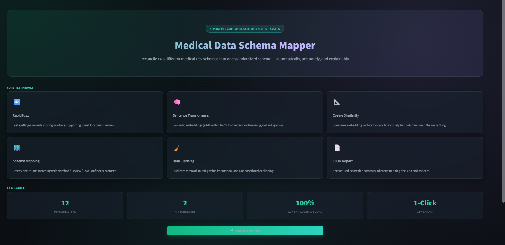
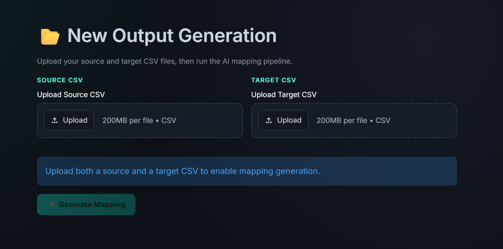
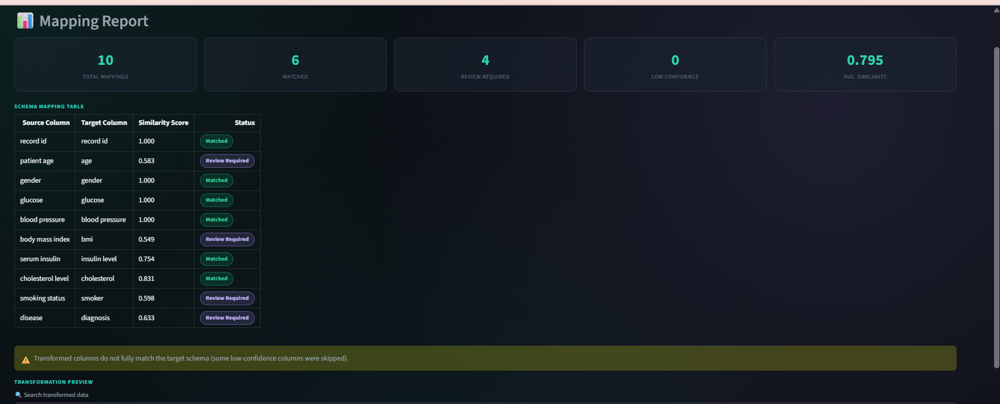
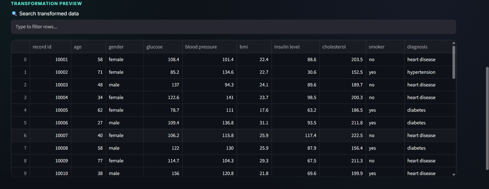
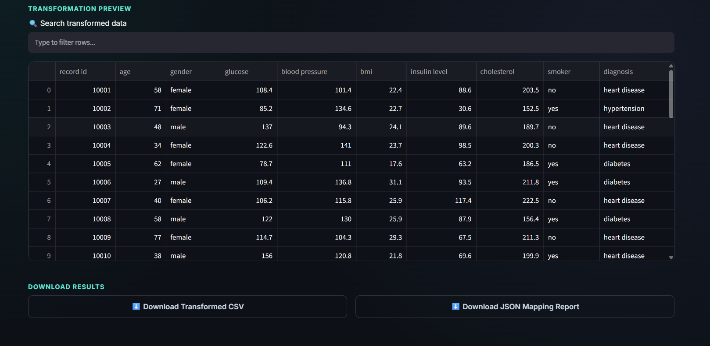
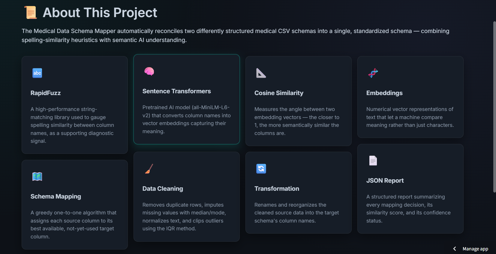

<div align="center">

<!-- Banner: replace with a real 1280x320 banner image at images/banner.png -->


# 🧬 Medical Data Schema Mapper

### AI-Powered Semantic Schema Matching for Healthcare Data

**Automatically reconcile two differently structured medical datasets into one standardized schema — using semantic AI, not just string matching.**

<br>


<br>

[Overview](#-project-overview) •
[Features](#-features) •
[Architecture](#-project-architecture) •
[Installation](#-installation) •
[Usage](#-usage) •
[Pipeline](#-ai-pipeline) •
[Roadmap](#-future-improvements)

</div>

---

## 📖 Project Overview

### The Problem

Healthcare organizations rarely agree on how to name a column. One hospital's export calls it `Sex`, another calls it `Gender`. One system uses `BP`, another writes out `Blood Pressure`. A third calls a patient identifier `MR No`, another calls it `Patient ID`. Multiply this across dozens of columns and two datasets that describe **exactly the same clinical concepts** end up structurally incompatible.

This is the **schema matching problem**, and in healthcare it is especially costly:

- Merging patient records from different EHR systems requires reconciling column semantics, not just names.
- Manual mapping is slow, repetitive, and error-prone — a single mismatched column (e.g. `Sex` matched to `Smoker`) can silently corrupt downstream analysis.
- Traditional exact-match or rule-based joins fail the moment naming conventions differ even slightly.

### Why Traditional String Matching Isn't Enough

Simple approaches like exact string comparison or basic fuzzy matching (e.g. edit distance) only capture **spelling similarity**, not **meaning**. This project's own pipeline demonstrates the failure mode directly: a pure spelling-based comparison scores `patient age` and `patient id` as highly similar (they share the word "patient"), and scores `sex` and `smoker` as deceptively similar — even though semantically they are unrelated. Spelling similarity alone produces **confidently wrong matches**.

### Why Semantic AI Is Needed

This project solves that problem by combining a lightweight spelling-similarity signal (RapidFuzz) with a **semantic understanding layer** powered by Sentence Transformers. Instead of comparing characters, the AI model converts column names into dense vector embeddings that capture their *meaning*, then measures the angle between those vectors (cosine similarity) to decide how closely two columns actually correspond — correctly identifying that `blood sugar` and `glucose` mean the same thing, even though they don't share a single character.

### Real-World Applications

| Domain | Application |
|---|---|
| 🏥 **Healthcare Interoperability** | Merging patient records exported from different Hospital Information Systems (HIS) or EHR vendors |
| 🏢 **Enterprise Data Integration** | Reconciling schemas during company mergers, acquisitions, or system migrations |
| 📊 **Data Warehousing / ETL** | Standardizing incoming feeds from multiple third-party data sources before loading |
| 🔬 **Clinical Research** | Harmonizing multi-site trial data that was collected with inconsistent field names |
| 🏛 **Regulatory Reporting** | Mapping internal data structures to standardized reporting schemas |

---

## ✨ Features

<table>
<tr>
<td width="50%" valign="top">

### 🧠 AI Schema Matching
Combines a fast spelling-similarity check with a Sentence Transformer model to understand the true meaning of column names, not just their characters.

### 📐 Cosine Similarity Scoring
Every source column is scored against every target column using cosine similarity on their embedding vectors, producing an interpretable 0–1 confidence score.

### 🗺️ One-to-One Mapping
A greedy assignment algorithm ensures every source column maps to its single best, not-yet-used target column — avoiding duplicate assignments.

### ✅ Mapping Validation
Every mapping is automatically classified as **Matched**, **Review Required**, or **Low Confidence** based on its similarity score.

### 🧹 Automated Data Cleaning
Duplicate rows are removed, missing values are imputed (median for numeric, mode for text), and outliers are clipped using the IQR method.

</td>
<td width="50%" valign="top">

### 🔍 Data Quality Validation
Shape, data types, missing-value counts, and duplicate-row counts are inspected for both the source and target datasets.

### 🔄 CSV Transformation
The cleaned source dataset is automatically rebuilt using the target schema's column names, skipping low-confidence mappings.

### 📄 JSON Mapping Report
A structured report summarizing every mapping decision, its similarity score, its confidence status, and overall statistics.

### 🖥️ Interactive Streamlit Dashboard
A full multi-page web application — upload, generate, review, and download — wrapped around the notebook's exact backend logic.

### ⬇️ One-Click Downloads
Both the transformed CSV and the JSON mapping report are available as instant downloads from the dashboard.

### 🎨 Professional UI
A custom dark theme (Sora + Inter typography, teal/indigo accent system) built specifically for this application — no default Streamlit styling.

</td>
</tr>
</table>

---

## 🏗️ Project Architecture



> **Note:** RapidFuzz's spelling score is computed and displayed as a **diagnostic/supporting signal only**. The final mapping decision is driven entirely by the Sentence Transformer's semantic cosine similarity, since spelling alone produces false positives (see [Project Overview](#-project-overview)).

---

## 🛠️ Tech Stack

| Technology | Role in This Project |
|---|---|
| **Python 3.10+** | Core programming language for the entire pipeline and application |
| **Pandas** | CSV reading, DataFrame manipulation, cleaning, and transformation |
| **NumPy** | Underlying numerical operations (via Pandas / scikit-learn) |
| **scikit-learn** | `cosine_similarity` — measures semantic closeness between column embeddings |
| **Sentence-Transformers** | `all-MiniLM-L6-v2` pretrained model — converts column names into meaning-bearing vectors |
| **RapidFuzz** | `fuzz.ratio` — fast spelling-similarity scoring used as a diagnostic signal |
| **Streamlit** | Powers the entire interactive web dashboard — no separate frontend framework |
| **JSON** | Structured output format for the mapping report |
| **CSV** | Input and output data format for both schemas and the transformed dataset |

---

## 🗂️ Dataset

The project ships with a synthetic **medical schema-mapping example** under `sample_data/` to demonstrate the pipeline end-to-end:

| File | Role | Example Columns |
|---|---|---|
| `medical_dataset_source_schema.csv` | **Source Schema** — represents one hospital's export format | `Record_ID`, `Patient Age`, `Sex`, `Blood Sugar`, `BP`, `Body Mass Index`, `Serum Insulin`, `Cholesterol Level`, `Smoking Status`, `Disease` |
| `medical_dataset_target_schema.csv` | **Target Schema** — represents the standardized format to map into | `Patient ID`, `Age`, `Gender`, `Glucose`, `Blood Pressure`, `BMI`, `Insulin Level`, `Cholesterol`, `Smoker`, `Diagnosis`, `Physician`, `Mobile No` |

**Purpose:** The two files intentionally use different naming conventions for the same underlying clinical fields, so the AI pipeline has a realistic mismatch to resolve. The target schema also includes columns (`Physician`, `Mobile No`) that don't exist in the source — demonstrating that the app correctly leaves genuinely unmatched columns unmapped rather than forcing a false match.

The app is **schema-agnostic**: any two CSV files can be uploaded through the dashboard, not just this sample pair.

---

## 🔬 AI Pipeline

Every run moves through the following stages, exactly as implemented in the source notebook (`notebook/schema-mapper.ipynb`) and ported into `utils.py`:

<table>
<tr><th width="6%">#</th><th width="24%">Step</th><th>What Happens</th></tr>
<tr><td>1</td><td><b>CSV Reading</b></td><td>Source and target CSV files are loaded into pandas DataFrames.</td></tr>
<tr><td>2</td><td><b>Column Standardization</b></td><td>Column names are lowercased, punctuation is stripped via regex, whitespace is collapsed, then a custom <code>ALIAS_DICT</code> normalizes known synonyms (e.g. <code>"sex" → "gender"</code>, <code>"bp" → "blood pressure"</code>, <code>"blood sugar" → "glucose"</code>).</td></tr>
<tr><td>3</td><td><b>RapidFuzz Matching</b></td><td><code>fuzz.ratio()</code> computes a spelling-similarity score between every source/target column pair. Displayed as a supporting diagnostic — not used for the final decision.</td></tr>
<tr><td>4</td><td><b>Sentence Embeddings</b></td><td>The <code>all-MiniLM-L6-v2</code> Sentence Transformer model encodes every standardized column name into a dense vector embedding.</td></tr>
<tr><td>5</td><td><b>Cosine Similarity</b></td><td><code>sklearn.metrics.pairwise.cosine_similarity</code> computes a full source × target similarity matrix from the embeddings.</td></tr>
<tr><td>6</td><td><b>One-to-One Mapping</b></td><td>For each source column, its scores are sorted highest → lowest, and it is greedily assigned to the best-scoring target column that hasn't already been used.</td></tr>
<tr><td>7</td><td><b>Mapping Validation</b></td><td>Each mapping is labeled by its similarity score: <b>Matched</b> (≥ 0.70), <b>Review Required</b> (0.50 – 0.69), or <b>Low Confidence</b> (&lt; 0.50).</td></tr>
<tr><td>8</td><td><b>Data Quality Check</b></td><td>Shape, dtypes, missing-value counts, and duplicate-row counts are computed for both datasets.</td></tr>
<tr><td>9</td><td><b>Data Cleaning</b></td><td>Duplicate rows dropped; numeric NaNs filled with the column median; text NaNs filled with the column mode; text trimmed and lowercased; numeric outliers clipped via the IQR method; index reset.</td></tr>
<tr><td>10</td><td><b>Data Transformation</b></td><td>A new DataFrame is built using target-schema column names, populated from the cleaned source data. Columns mapped as <b>Low Confidence</b> are automatically excluded.</td></tr>
<tr><td>11</td><td><b>CSV Output</b></td><td>The transformed dataset is saved as <code>transformed_dataset.csv</code>.</td></tr>
<tr><td>12</td><td><b>JSON Report</b></td><td>A summary report (<code>schema_mapping_report.json</code>) is generated with per-column mapping details and aggregate statistics.</td></tr>
</table>

---

## 🧮 Algorithm

<details>
<summary><b>Click to expand the mathematical intuition</b></summary>

<br>

**1. RapidFuzz — Spelling Similarity (`fuzz.ratio`)**

Computes a normalized edit-distance-based similarity between two strings, returning a score from 0–100 based on the number of character edits needed to transform one string into the other. Fast, but blind to meaning — `"patient age"` and `"patient id"` score highly despite being unrelated.

**2. Sentence Embeddings**

The `all-MiniLM-L6-v2` model maps each column name string into a fixed-length dense vector `v ∈ ℝⁿ` such that strings with similar *meaning* are positioned close together in vector space — regardless of spelling overlap.

**3. Cosine Similarity**

For two embedding vectors **A** and **B**, cosine similarity measures the cosine of the angle between them:

```
cosine_similarity(A, B) = (A · B) / (‖A‖ × ‖B‖)
```

The result ranges from 0 (unrelated meaning) to 1 (identical meaning), independent of vector magnitude — which is what allows `"blood sugar"` and `"glucose"` to score close to 1.0 despite sharing no characters.

**4. Greedy One-to-One Mapping**

For each source column, its similarity scores against all target columns are sorted descending. The algorithm walks the sorted list and assigns the **first target column not already claimed** by another source column, guaranteeing a valid one-to-one assignment without needing a global optimization solver.

**5. Confidence Thresholding**

```
score ≥ 0.70            → "Matched"
0.50 ≤ score < 0.70      → "Review Required"
score < 0.50             → "Low Confidence"
```

**6. Data Transformation**

For every mapping where `status != "Low Confidence"`, the source column's data is copied into a new DataFrame under the target column's name — effectively re-projecting the cleaned source dataset onto the target schema.

</details>

---

## 🔄 Project Workflow



---

## 📁 Project Structure

```
medical-data-schema-mapper/
│
├── app.py                              # Streamlit frontend — pages, sidebar, routing
├── utils.py                            # Backend pipeline logic (ported from the notebook)
├── style.css                           # Custom dark theme (Sora + Inter, teal/indigo palette)
├── requirements.txt                    # Python dependencies
│
├── notebook/
│   └── schema-mapper.ipynb             # Original research notebook — source of truth for the pipeline
│
├── sample_data/
│   ├── medical_dataset_source_schema.csv
│   └── medical_dataset_target_schema.csv
│
├── images/
│   └── banner.png                      # README banner / screenshots
│
└── README.md                           # You are here
```

---

## ⚙️ Installation

### Requirements

- Python 3.10 or higher
- pip
- Internet access on first run (to download the `all-MiniLM-L6-v2` model weights from Hugging Face)

### Steps

```bash
# 1. Clone the repository
git clone https://github.com/rizwanahmed786508/medical-data-schema-mapper.git
cd medical-data-schema-mapper

# 2. Create and activate a virtual environment
python -m venv venv
source venv/bin/activate        # On Windows: venv\Scripts\activate

# 3. Install dependencies
pip install -r requirements.txt

# 4. Run the application
streamlit run app.py
```

The app will open automatically at `http://localhost:8501`.

> 💡 **Tip:** The Sentence Transformer model is cached via `st.cache_resource`, so it only downloads and loads once per session — subsequent runs are fast.

---

## 🚀 Usage

1. **Upload Source CSV** — go to **New Output Generation** and upload the file representing your source schema.
2. **Upload Target CSV** — upload the file representing the schema you want to standardize into.
3. **Generate Mapping** — click the button to run the full 12-step AI pipeline.
4. **Preview Results** — visit **Mapping Report** to see the schema mapping table, similarity scores, confidence badges, and a searchable preview of the transformed data.
5. **Download CSV** — export the cleaned, transformed dataset in the target schema.
6. **Download JSON** — export the full mapping report for auditing or downstream use.

---

## 🖼️ Screenshots

<div align="center">

| Home | Upload |
|---|---|
|  |  |

| Schema Mapping | Results |
|---|---|
|  |  |

| Download | About |
|---|---|
|  |  |

</div>

> ⚠️ **Note:** Add your own screenshots to the `images/` folder using the filenames above — these are placeholders.

---

## 📤 Outputs

| Output | Description |
|---|---|
| **`transformed_dataset.csv`** | The cleaned source dataset, re-mapped onto the target schema's column names. Columns mapped with **Low Confidence** are excluded. |
| **`schema_mapping_report.json`** | A structured report containing total column counts, the count of Matched / Review Required / Low Confidence mappings, the average similarity score across all mappings, and a full per-column mapping breakdown (source column, target column, similarity score, status). |

---

## 📊 Performance

This project does not rely on a fixed benchmark dataset or a pre-computed accuracy metric — matching quality depends on the specific pair of CSV files provided at runtime. Instead, the pipeline surfaces **transparent, per-run confidence signals**:

- Every mapping carries its own **cosine similarity score (0–1)**.
- The JSON report's **`Average Similarity Score`** summarizes overall mapping confidence for that run.
- Mappings are bucketed into `Matched` / `Review Required` / `Low Confidence` so a human reviewer can focus attention exactly where the model is least certain, rather than trusting a single opaque output.

> 📌 If you evaluate this pipeline against a labeled ground-truth schema mapping, consider reporting precision/recall on the `Matched` bucket as a natural next step — see [Future Improvements](#-future-improvements).

---

## 🔮 Future Improvements

- [ ] **Large Language Model (LLM) matching** — use an LLM to resolve ambiguous or low-confidence mappings with contextual reasoning.
- [ ] **Healthcare Standards Support (FHIR / HL7)** — map directly onto standardized healthcare data models instead of arbitrary target schemas.
- [ ] **Knowledge Graphs & Ontology Mapping** — ground column meaning in a medical ontology (e.g. SNOMED CT, LOINC) for more principled matching.
- [ ] **Vector Database Integration** — persist embeddings in a vector store (e.g. FAISS, Pinecone) to scale matching across many schemas.
- [ ] **Retrieval-Augmented Generation (RAG)** — retrieve similar past mappings to guide new, ambiguous decisions.
- [ ] **Multi-language Support** — extend column-name understanding beyond English.
- [ ] **Cloud Deployment** — containerize and deploy on AWS/GCP/Azure with autoscaling.
- [ ] **Explainable AI** — surface *why* two columns were matched (e.g. nearest-neighbor examples from the embedding space).
- [ ] **Batch Processing** — support mapping many file pairs in a single run via a queue or CLI mode.
- [ ] **Human-in-the-loop correction** — let reviewers confirm or override `Review Required` mappings directly in the dashboard.

---

## 🎓 Learning Outcomes

This project demonstrates applied, end-to-end competency across:

**Machine Learning & NLP**
- Using pretrained sentence embedding models for semantic similarity tasks
- Vector-space reasoning via cosine similarity
- Combining a lexical signal (RapidFuzz) with a semantic signal to reason about the limitations of pure string matching

**Data Engineering**
- Schema normalization and alias resolution
- Data quality auditing (missing values, duplicates, dtype inspection)
- Robust data cleaning (median/mode imputation, IQR-based outlier handling)
- Building reproducible, function-based data pipelines from exploratory notebook code

**Software Engineering & Product**
- Refactoring notebook research code into a modular, testable Python package (`utils.py`)
- Building a production-facing interactive dashboard with Streamlit
- Designing a custom UI/UX system (typography, color theory, component states) from scratch

---

## 📜 License

This project is licensed under the **MIT License** — see the [LICENSE](LICENSE) file for details.

---

## 👤 Author

**Rizwan Ahmed**
Machine Learning / AI Engineering Intern — **NGC Lahore**

- 🔗 GitHub: [@rizwanahmed786508](https://github.com/rizwanahmed786508)

---

## 🙏 Acknowledgements

This project builds on the excellent work of the open-source community:

- [Sentence-Transformers](https://www.sbert.net/) — for the `all-MiniLM-L6-v2` embedding model
- [RapidFuzz](https://github.com/rapidfuzz/RapidFuzz) — for fast string similarity scoring
- [scikit-learn](https://scikit-learn.org/) — for cosine similarity computation
- [Pandas](https://pandas.pydata.org/) & [NumPy](https://numpy.org/) — for data manipulation
- [Streamlit](https://streamlit.io/) — for making the dashboard possible without a separate frontend stack

<div align="center">

**⭐ If you found this project useful, consider starring the repository!**

</div>
